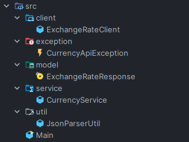

# 💱 Conversor de Monedas - Java 21

Aplicación de consola desarrollada en **Java 21** bajo el paradigma de **Programación Orientada a Objetos (POO)** que consume la **Exchange Rate API** para realizar conversiones de monedas en tiempo real.

---

## 🚀 Descripción del Proyecto

Este proyecto implementa un conversor de monedas interactivo en consola que permite convertir entre:

- USD ↔ ARS
- USD ↔ BRL
- USD ↔ COP
- USD ↔ EUR

La aplicación está estructurada siguiendo principios de **arquitectura por capas**, separación de responsabilidades y buenas prácticas de **Clean Code**.

---
##📋 Metodología de Trabajo

Se utilizó metodología Kanban para la gestión del proyecto.

🗂 Herramienta utilizada:

Trello

Columnas empleadas:
- Backlog
- En Desarrollo
- Pausado
- Concluido
  
---
## 🛠 Tecnologías Utilizadas

| Tecnología | Versión |
|------|----------------|
| Java | 21 |
| Librería Gson | 2.13.2 |

## 🏗 Arquitectura del Proyecto

El sistema sigue una arquitectura desacoplada en capas:

Cada capa tiene una responsabilidad clara:

| Capa | Responsabilidad |
|------|----------------|
| `Main` | Interacción con el usuario |
| `service` | Reglas de negocio |
| `client` | Comunicación con la API |
| `util` | Conversión JSON ↔ Objetos |
| `model` | Representación de datos |

---

## 📂 Estructura de Carpetas



---

## 🌍 API Utilizada

### 🔗 Exchange Rate API

Se utiliza la API pública:
https://v6.exchangerate-api.com/v6/{API_KEY}/pair/{BASE}/{TARGET}/{AMOUNT}


Ejemplo real:
### Ejemplo de respuesta JSON:

```json
{
  "result": "success",
  "base_code": "USD",
  "target_code": "COP",
  "conversion_rate": 3703.6183,
  "conversion_result": 370361.83
}
```
## 🖥 Ejecución


🧠 Modelo de Datos (Record)

Se utiliza record de Java 21 para representar la respuesta de la API:


